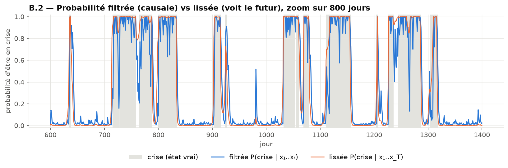
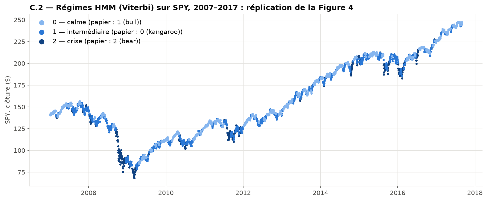
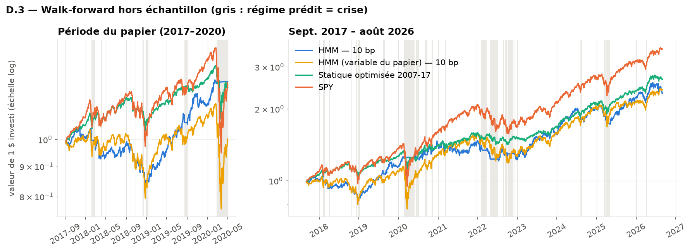

# Hidden Markov Models for Time-Series Segmentation

**Découper une série financière en régimes de marché avec un HMM gaussien.** Réplication critique de Wang, Lin & Mikhelson (2020), *Regime-Switching Factor Investing with Hidden Markov Models* (Journal of Risk and Financial Management 13(12), 311, [accès libre](https://www.mdpi.com/1911-8074/13/12/311)), avec un algorithme forward codé à la main et un backtest walk-forward sans biais d'anticipation. Python, `hmmlearn`, scikit-learn, pandas, statsmodels.

> 🚧 **Projet en cours.** Les résultats ci-dessous sont préliminaires et susceptibles d'évoluer ; voir [Statut et prochaines étapes](#statut-et-prochaines-étapes) en fin de page.

> **En bref.** La détection de régimes du papier se reproduit presque au centième (fréquences, rendements et volatilités des régimes, matrice de transition). En revanche, dans un backtest walk-forward qui n'utilise que l'information disponible à chaque date, avec des frais, le Sharpe d'environ 2 annoncé par le papier tombe autour de 0,5, sans avantage significatif sur SPY. Plusieurs choix méthodologiques du papier expliquent l'écart.

```
├── src/                    # code réutilisable
│   ├── forward.py          #   algorithme forward normalisé codé à la main, simulation d'un HMM
│   ├── hmm_model.py        #   estimation multi-initialisations, label switching, BIC, durées
│   ├── features.py         #   variables du HMM (définition du papier + volatilité réalisée)
│   ├── regimes.py          #   KMeans, règle de seuil, persistance des régimes
│   ├── backtest.py         #   walk-forward sans anticipation, filtres anti-allers-retours, frais
│   ├── stats.py            #   indicateurs de performance
│   └── data.py, pipeline.py, allocation.py, plotting.py
├── notebooks/              # 01 simulation et forward · 02 réplication · 03 backtest
├── tests/                  # 28 tests : forward, variables, statistiques, absence d'anticipation
├── scripts/run_walkforwards.py
├── data/README.md          # sources et téléchargement des données (non versionnées)
└── results/                # figures et tableaux cités ici
```

---

## 1. Ce que dit le papier

**Question** : peut-on améliorer une stratégie factorielle en changeant de modèle selon le régime de marché ?
**Méthode** : HMM gaussien à 3 états (`hmmlearn`, covariance pleine) sur deux variables de l'ETF S&P 500, le rendement journalier et une « volatilité » (variance des prix de clôture sur 10 jours), estimé sur 2007–2017. Les états s'interprètent comme un marché haussier calme, un marché « sans direction » et un marché baissier très volatil. Une règle de détection fait ensuite alterner la stratégie entre des modèles factoriels construits sur QuantConnect.
**Résultat annoncé** : Sharpe 2,02, ratio d'information 1,64, drawdown maximal 12,8 % sur septembre 2017 – avril 2020.

## 2. Comprendre le HMM sur données simulées ([`notebooks/01`](notebooks/01_partie_B_simulation_forward.ipynb))

Avant d'utiliser le modèle sur des données de marché, je le teste sur un HMM simulé dont je connais les vrais états et paramètres (2 régimes, calme et crise, 3 000 jours).

- **Forward codé à la main** ([`src/forward.py`](src/forward.py)) : récurrence normalisée à chaque pas, qui donne directement la probabilité **filtrée** $P(S_t \mid x_1, \dots, x_t)$, la seule utilisable pour trader. Sans normalisation, les probabilités tombent à 0 (underflow) après environ 600 jours.
- **Validation** ([`tests/test_forward.py`](tests/test_forward.py)) : même log-vraisemblance que `hmmlearn` à la précision machine, dernière probabilité filtrée égale à la dernière probabilité lissée, causalité (modifier le futur ne change pas le passé), cas limites dont la réponse est connue analytiquement.
- **Estimation** : l'EM retrouve bien les volatilités et les transitions, mal les rendements moyens ; plusieurs initialisations sont nécessaires (optima locaux). Les étiquettes des états changent d'une estimation à l'autre (*label switching*) : je les trie par volatilité croissante.



## 3. Réplication des régimes ([`notebooks/02`](notebooks/02_partie_C_replication.ipynb))

SPY journalier, entraînement du 03/01/2007 au 31/08/2017, 3 états, covariance pleine, variables standardisées sur la seule fenêtre d'entraînement.

| Régime (ici → papier) | Fréquence ici / papier | Rendement moyen (%/j) ici / papier | « Volatilité » ($²) ici / papier |
|---|---|---|---|
| calme → 1 « bull » | 0,446 / 0,446 | 0,045 / 0,046 | 0,94 / 0,94 |
| intermédiaire → 0 « kangaroo » | 0,425 / 0,424 | 0,041 / 0,040 | 3,47 / 3,47 |
| crise → 2 « bear » | 0,128 / 0,130 | −0,066 / −0,066 | 13,63 / 13,63 |

La matrice de transition (durées moyennes de 16, 10 et 9 jours) et la courbe de log-vraisemblance selon le nombre d'états correspondent aussi.



**Ce que la réplication fait apparaître**
- Ces chiffres ne se retrouvent qu'avec le prix **brut** (non ajusté des dividendes) et une classification par **Viterbi**, qui utilise toute la série, futur compris.
- La « volatilité » du papier est une variance de **prix**, en dollars² : elle grandit avec le niveau de l'indice et n'est pas stationnaire ([figure](results/figures/C1_volatilite_papier_vs_realisee.png)).
- Les régimes séparent des niveaux de **volatilité**, pas de rendement : le rendement moyen du régime « bear » n'est pas significativement négatif.
- Le **BIC** ne confirme pas le choix de 3 états : il continue de baisser jusqu'à 6, parce que les observations sont très autocorrélées à l'intérieur de chaque régime, alors que le HMM les suppose indépendantes. Je garde 3 états pour l'interprétabilité et la persistance.
- **Méthodes simples** : une règle « volatilité > 90ᵉ centile historique » retrouve l'essentiel des crises du HMM ; un KMeans sur les mêmes variables échoue (il découpe selon le signe du rendement, sans persistance).

## 4. Backtest walk-forward sans biais d'anticipation ([`notebooks/03`](notebooks/03_partie_D_backtest.ipynb))

**Protocole** ([`src/backtest.py`](src/backtest.py)) : chaque mois, le HMM est réestimé sur les 2 707 jours qui précèdent **strictement** le mois (fenêtre du papier), avec une standardisation calculée sur cette fenêtre et un tri des états par volatilité. Chaque jour, la probabilité filtrée donne le régime prédit pour le lendemain ; l'allocation est décidée à la clôture de $t$ et détenue en $t+1$. Frais : 10 points de base par jambe échangée. L'absence d'anticipation est vérifiée par des tests ([`tests/test_no_lookahead.py`](tests/test_no_lookahead.py)) : les probabilités restent identiques si l'on tronque ou falsifie les données futures.

**Choix par rapport au papier** : les modèles QuantConnect sont remplacés par les facteurs publics de Kenneth French (marché, SMB, HML, momentum) ; la volatilité réalisée des rendements remplace la variance des prix ; la table « régime → facteur » est apprise sur 2007–2017 avec le rendement du **lendemain** du régime prédit, et non du jour même.

| Sept. 2017 → avr. 2020 (période du papier) | Sharpe | ± erreur-type | Max drawdown |
|---|---|---|---|
| Papier : stratégie HMM | 2,02 | — | 12,8 % |
| HMM, walk-forward, 10 bp de frais | 0,56 | 0,66 | 22,5 % |
| SPY | 0,38 | 0,64 | 33,7 % |

| Sept. 2017 → août 2026 | Sharpe | ± erreur-type | Max drawdown |
|---|---|---|---|
| HMM, walk-forward, 10 bp de frais | 0,54 | 0,36 | 22,5 % |
| SPY | 0,71 | 0,37 | 33,7 % |



Résultats préliminaires complémentaires :
- **Test long 2004–2026**, table « régime → facteur » réapprise à chaque réestimation : la rotation factorielle ne bat pas SPY. Seule une règle simple, réduire l'exposition en régime de crise, diminue nettement le drawdown ([figure](results/figures/D5_test_long.png)).
- **Frais et allers-retours** : environ 14 changements de régime par an ; hystérésis, lissage des probabilités et durée minimale en limitent le nombre.
- **Mars 2020** : la crise est détectée à la clôture du 24 février, 3 jours de bourse après le plus haut, mais le régime de crise ne se termine qu'après une large partie du rebond.

## 5. Limites

- Les modèles factoriels du papier ne sont pas reproductibles ; les facteurs de French sont des portefeuilles théoriques, bruts de leurs propres frais de rotation.
- Les écarts de Sharpe entre stratégies restent inférieurs à une erreur-type : aucun n'est statistiquement significatif à ce stade.
- Le modèle gaussien est mal spécifié pour une volatilité asymétrique et autocorrélée ; le choix de 3 états reste un jugement.
- Les paramètres (fenêtre de 2 707 jours, 10 jours de volatilité, réestimation mensuelle, frais) ont été fixés à l'avance et non optimisés ; leur sensibilité n'est que partiellement étudiée.

## 6. Reproduire

Python 3.12. Depuis la racine du dépôt :

```bash
pip install -r requirements.txt
python -m src.data                       # télécharge les données dans data/ (voir data/README.md)
python -m pytest                         # 28 tests
python scripts/run_walkforwards.py       # walk-forwards 2017-2026 et 2004-2026 (≈ 10 min, mis en cache)
jupyter nbconvert --to notebook --execute --inplace --ExecutePreprocessor.timeout=1800 notebooks/*.ipynb
```

Les figures et tableaux sont réécrits dans `results/`. Toutes les graines aléatoires sont fixées.

## Statut et prochaines étapes

Fait (première version) : simulation et forward codé à la main, réplication des régimes du papier, comparaison du nombre d'états par BIC, comparaison à des méthodes simples, backtest walk-forward mensuel avec frais sur 2017–2026 et 2004–2026.

En cours / à venir :
- [ ] allocation multi-actifs (SPY / obligations longues / or / monétaire) pilotée par les régimes, comparée à un portefeuille 60/40 (en cours) ;
- [ ] ajout du VIX et de la pente de la courbe des taux comme observations du HMM ;
- [ ] réestimation quotidienne, comme dans le papier, et comparaison avec la version mensuelle ;
- [ ] tests de significativité plus robustes (bootstrap par blocs, *deflated Sharpe ratio*) ;
- [ ] émissions non gaussiennes ou volatilité en log, pour réduire la mauvaise spécification révélée par le BIC ;
- [ ] appariement des états d'une réestimation à l'autre (algorithme hongrois) plutôt qu'un simple tri par volatilité ;
- [ ] version anglaise du README.

**Licences et sources** : l'article est publié en accès libre sous licence CC BY 4.0 ; les chiffres du papier cités ici en proviennent. Les facteurs de Kenneth French sont mis à disposition gratuitement par la Tuck School of Business (Dartmouth). Les prix Yahoo Finance sont soumis aux conditions d'utilisation de Yahoo et ne sont pas redistribués : ils sont téléchargés par le script (voir [`data/README.md`](data/README.md)).
